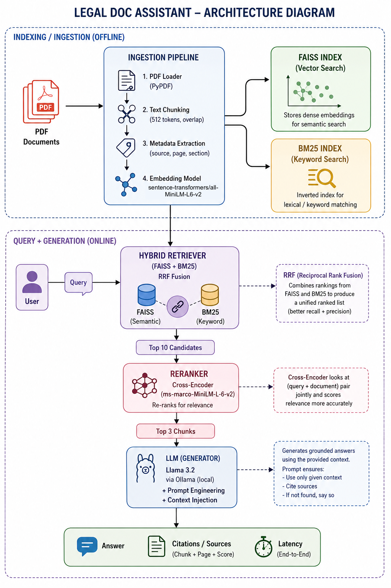

# ⚖️ Harvey-LegalDocAssistant

> Ask questions about Indian legal documents and get precise, 
> cited answers powered by local AI. No data ever leaves your machine.

---

## ⍰ What is this?

Harvey, the Legal Document Assistant, is a production-grade **Retrieval Augmented Generation (RAG)** 
system built for Indian legal documents. Upload any legal PDF like contracts, 
lease deeds, power of attorney documents, judgements and ask questions 
in plain English. The AI answers strictly from your documents with exact 
page citations.

**Runs 100% locally using Ollama. Zero cloud API costs. Complete privacy.**

---

## ▶️ Demo

**Question:** "What are the obligations of the lessee?"

**Answer:** "According to Section 3(a) of the lease deed, the Lessee is 
required to pay monthly ground rent on the due dates. As per Clause d, 
the Lessee is also at liberty to carry out additions or alterations to 
the buildings..."

---

## 🧱 Architecture


---

## ⚒️ Tech Stack

| Layer | Technology |
|---|---|
| LLM | Llama 3.2 via Ollama (local) |
| Embeddings | sentence-transformers/all-MiniLM-L6-v2 |
| Vector Store | FAISS |
| Keyword Search | BM25 (rank-bm25) |
| Fusion | Reciprocal Rank Fusion (RRF) |
| Reranker | cross-encoder/ms-marco-MiniLM-L-6-v2 |
| Framework | LangChain |
| Backend | FastAPI |
| Frontend | Streamlit |
| Containerisation | Docker |

---

## 🎚️ Features

- **Hybrid Search** — Combines semantic vector search (FAISS) with 
  keyword search (BM25) using Reciprocal Rank Fusion
- **Cross-Encoder Reranking** — Reranks top candidates for maximum precision
- **Chat Memory** — Supports multi-turn conversations with context
- **Source Citations** — Every answer cites exact PDF filename and page number
- **Hallucination Guard** — LLM is strictly constrained to document context
- **Latency Tracking** — Per-request breakdown of retrieval, reranking, 
  and LLM time
- **Evaluation Pipeline** — Automated faithfulness and keyword hit rate metrics
- **100% Local** — Runs entirely on your machine via Ollama

---

## Project Structure
LegalDocAssistant/
│
├── backend/
│   ├── ingestion.py        # Document loading, chunking, embedding
│   ├── retriever.py        # Hybrid retrieval (FAISS + BM25)
│   ├── reranker.py         # Cross-encoder reranking
│   ├── rag_pipeline.py     # Core RAG orchestration
│   └── main.py             # FastAPI server
│
├── frontend/
│   └── app.py              # Streamlit UI
│
├── evaluation/
│   └── eval_pipeline.py    # Metrics & evaluation scripts
│
├── data/
│   └── documents/          # Input PDF files
│
├── .env.example            # Environment configuration template
├── requirements.txt        # Python dependencies
└── Dockerfile              # Containerization setup
---

## Setup & Running

### Prerequisites
- Python 3.10+
- [Ollama](https://ollama.com/download) installed

### 1. Clone the repo
```bash
git clone https://github.com/YOUR_USERNAME/LegalDocAssistant.git
cd LegalDocAssistant
```

### 2. Pull the required models
```bash
ollama pull llama3.2
ollama pull nomic-embed-text
```

### 3. Create virtual environment
```bash
python3 -m venv venv
source venv/bin/activate
pip install -r requirements.txt
```

### 4. Set up environment variables
```bash
cp .env.example .env
```

### 5. Add your legal PDFs
Drop any Indian legal PDFs into `data/documents/`

### 6. Run ingestion
```bash
python -m backend.ingestion
```

### 7. Start the backend
```bash
uvicorn backend.main:app --reload --port 8000
```

### 8. Start the frontend
```bash
streamlit run frontend/app.py
```

Open `http://localhost:8501` in your browser.

---

## Evaluation

Run the evaluation pipeline to measure answer quality:

```bash
python -m evaluation.eval_pipeline
```

Outputs faithfulness scores, keyword hit rates, and latency per question.
Results saved to `evaluation/eval_report.json`.

---

## Environment Variables

| Variable | Default | Description |
|---|---|---|
| `OLLAMA_BASE_URL` | `http://localhost:11434` | Ollama server URL |
| `LLM_MODEL` | `llama3.2` | Ollama model name |
| `EMBEDDING_MODEL` | `nomic-embed-text` | Embedding model |

---

## Built By

**Suhani Sengar** — Final year B.Tech AI/ML, VIT Chennai
